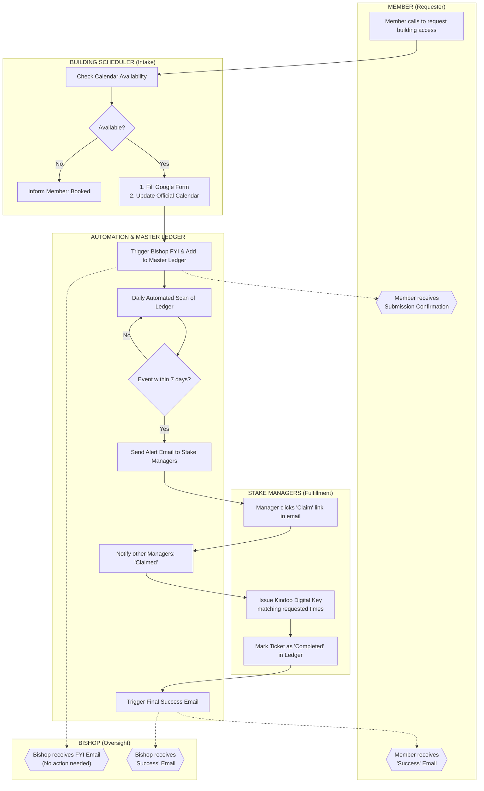

# Building Access Workflow

```mermaid
graph TD
    subgraph "MEMBER (Requester)"
        A1[Member calls to request building access]
        L0{{"Member receives <br/>Submission Confirmation"}}
        L1{{"Member receives <br/>'Success' Email"}}
    end

    subgraph "BUILDING SCHEDULER (Intake)"
        B1[Check Calendar Availability]
        B2{Available?}
        B2 -- No --> B3[Inform Member: Booked]
        B4[1. Fill Google Form <br/>2. Update Official Calendar]
    end

    subgraph "AUTOMATION & MASTER LEDGER"
        C1[Trigger Bishop FYI & Add to Master Ledger]
        C2[Daily Automated Scan of Ledger]
        C3{Event within 7 days?}
        C4[Send Alert Email to Stake Managers]
        H1[Notify other Managers: 'Claimed']
        K1[Trigger Final Success Email]
    end

    subgraph "STAKE MANAGERS (Fulfillment)"
        G1[Manager clicks 'Claim' link in email]
        I1[Issue Kindoo Digital Key <br/>matching requested times]
        J1[Mark Ticket as 'Completed' in Ledger]
    end

    subgraph "BISHOP (Oversight)"
        E1{{"Bishop receives FYI Email <br/>(No action needed)"}}
        L2{{"Bishop receives <br/>'Success' Email"}}
    end

    %% Connections
    A1 --> B1
    B1 --> B2
    B2 -- Yes --> B4
    B4 --> C1
    C1 -.-> E1
    C1 -.-> L0
    C1 --> C2
    C2 --> C3
    C3 -- No --> C2
    C3 -- Yes --> C4
    C4 --> G1
    G1 --> H1
    H1 --> I1
    I1 --> J1
    J1 --> K1
    K1 -.-> L1
    K1 -.-> L2
```
